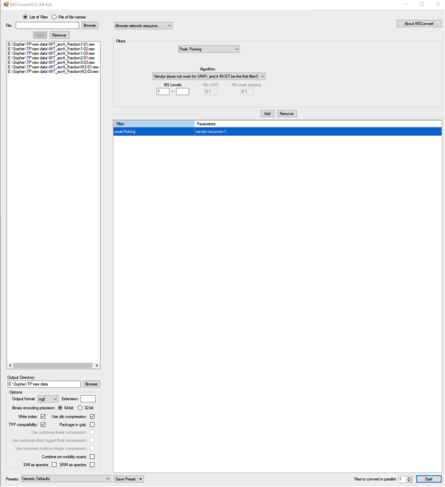

# tp-proteomics
## Contexte Biologique
Vous allez utiliser des outils informatiques qui vous permettront d’analyser des données brutes issues d’une analyse Shotgun Proteomics récemment publiée dans le journal Science sous le titre "Real-time visualization of drug resistance acquisition by horizontal gene transfer reveals a new role for AcrAB-TolC multidrug efflux pump".

Les données associées à cette publication sont publiques et accessibles sur la plateforme [PRIDE](https://www.ebi.ac.uk/pride/archive/projects/PXD011286). Le PDF de la publication est [`data/Nolivos_2019.pdf`](data/Nolivos_2019.pdf).

## Mise en place

### Méthodologie

Vous forkerez le présent "repository" pour vous permettre de sauvegarder votre travail.
Vous éditerez ce fichier `README.md` pour répondre aux questions dans les encarts prévus à cet effet et inserer les figures que vous aurez générées. Ce "repository" vous appartenant, vous pouvez créer tous les repertoires et fichiers necessaires à la conduite du TP.

## I ) Recherche et identification de protéines (peptides) à partir d’expériences de Shotgun Proteomics

L’objectif principal de cette partie est de vous familiariser avec le pipeline d’analyse de données en shotgun proteomics (approche bottum-up) que nous avons vu en cours. 

### Ressources

Outils à récupérer sur la plateforme pédagogique :
- proteowizard: http://proteowizard.sourceforge.net/ (windows uniquement)
- searchgui: http://compomics.github.io/projects/searchgui.html (version windows, version mac + linux)
- peptide shaker: http://compomics.github.io/projects/peptide-shaker.html (toutes les plateformes)

Dans un dossier où vous conserverez toutes les données de ce TP, vous aurez placé au préalable les fichiers suivants :
- données brutes du QEXactive (extension .raw)
- fichiers convertis des données MS (extension .mgf)

### Observations

Cette partie du TP est découpée en 4 grandes parties avec pour chacune des parties, le cheminement à suivre qui n’est pas exhaustif, c’est-à-dire que vous pouvez de vous-même aller explorer les différentes options proposées par les logiciels (en particulier PeptideShaker). A l’issue du TP, vous completerez le fichier markdown avec vos réponses aux différentes questions qui vous seront posées.

### Création de la base de données des protéines

#### Questions: 

##### En quoi consiste l’approche Shotgun proteomics?

```

```

##### Quel est l’objectif de cette approche ?

```

```

#### Procédure
-	Rechercher la base de données des protéines d’E. coli sur [UNIPROT](https://www.uniprot.org/)
-	Télécharger toutes les séquences FASTA des protéines Swiss-prot. : format canonical, uncompressed (onglet download).
-	Sauvegarder le fichier FASTA
-	Télécharger le fichier FASTA correspondant à la protéine suivante : « P00761 ».
-	Copier le fichier FASTA de la protéine P00761 à la suite du fichier FASTA du protéome bactérien.
-	NB : le fichier FASTA s’ouvre avec un éditeur de texte. 

#### Questions

##### L’identification des protéines/ peptides se réalise grâce à une base de données de protéines. Quelle comparaison va être effectuée?

```

```

##### Existe t’il d’autres types de bases de données pour réaliser l’identification des peptides trypsiques dans un spectre?

```

```

##### Est-ce qu’il est possible d’identifier des peptides sans base de données?
```

```
##### Combien de protéines sont identifiées dans le protéome bactérien?
```

```
##### Comment la liste des séquences des protéines est-elle établie ? Est-elle complète? 
```

```
##### Quelle est la différence entre des séquences Swiss-prot et TremBL?
```

```
##### A quoi correspond la protéine P00761 et quelle est sa fonction ? 
```

```
##### Pourquoi doit-on rajouter cette protéine dans le fichier FASTA final du protéome bactérien?
```

```

### Création de la « peak list »

De nombreux petits logiciels existent pour convertir vos fichiers bruts dans un format lisible par les moteurs de recherche. Il existe de nombreux formats de fichiers (diversité des appareillages, équipementiers etc..) qui ne peuvent pas être exploités directement. Vous trouverez en Open access de nombreux convertisseurs de fichiers MSConvert (Proteowizard), PAVA etc… Ici vous allez utiliser MSconvert (plateforme pédagogique).

1. Cliquer sur MSConvertGUI.exe
2. l’interface graphique MSConvert va s’afficher : 

3. charger le fichier .raw (en haut à gauche, File-browse-add)
4. charger un fichier de destination (TP MADP)
5. output format : sélectionner mgf et laisser les autres paramètres par défaut
6. dans la section filters, sélectionner peak picking, Algorithme vendor –cliquer sur add
7. cliquer sur start
8. les fichiers.raw doivent être convertis en .mgf


#### Question

##### Les données de QExactive ont été enregistrées en mode centroïde et non pas en mode Profiling. D’après vous quelle est la différence entre les deux modes?

```

```

### Identification des peptides par approche PSM Peptide to Spectrum Matching

1. Cliquer sur SearchGUI-3.3.20.jar
NB : si vous avez des messages d’erreur qui s’affichent (missing precursor charges) à un moment donné du process – mettez NO 
2. charger le fichier .mgf (spectrum file)
3. charger un fichier de destination (TP MADP)
4. dans l’onglet search settings, vous allez définir vos paramètres de recherche (cf. Material & Methods de l’article): add
5. donner un nom à vos paramètres de recherche et cliquer sur Spectrum matching
6. Charger votre fichier .FASTA 
7. Ajouter les modifications fixes et variables 
8. Rentrer les paramètres suivants : enzyme, missed cleavage, fragments, tolerance (comme illustré) 
9. Cliquer sur OK et enregistrer votre recherche 
10. Dans la page de dialogue SearchGUI, sélectionner les deux moteurs de recherche X.tandem et OMSSA. 
11. Cliquer sur START 
12. Une page de dialogue va s’afficher, montrant l’avancée de la recherche. 
13. Dans votre fichier d’enregistrement de vos données, vous allez obtenir un fichier de sortie qui est nommé searchgui_out.zip. Il contient le fichier d’analyse OMSSA (.omx) et X ! Tandem (.xml)

#### Questions 
##### Pourquoi est-il important de bien choisir sa base de données?
```
```
##### Est-ce que l’on retrouvera toujours les mêmes protéines au cours du temps ?
```
```

##### Comment la taille de la base de données peut affecter le score de la protéine recherchée?
```
```

##### Est-ce que les modifications ajoutées sont les seules modifications que l’on peut attendre dans une expérience de shotgun proteomics?
```
```

##### Vous avez choisi la trypsine comme enzyme et choisi « specific », qu’est-ce que cela signifie, et comment cela peut affecter le processing ? 
```
```

##### Qu’est-ce qu’un missed cleavage ? pourquoi 2 et pas 0 ?
```
```
##### Qu’est-ce que la tolérance en masse, comment la calcule-t-on ?
```
```

### Visualisation des PSM, peptides - protéines

Après avoir l’interrogation des données avec les moteurs de recherche, nous allons utiliser PeptideShaker pour identifier les peptides et protéines. Cliquer sur le fichier PeptideShaker-1.16.45.jar dans le dossier PeptideShaker-1.16.45. 
Une page de dialogue va s’ouvrir et cliquer sur New project.

Project details : 
- Donner un nom au projet
- Donner un nom à l’échantillons 
Input files : 
- Charger le fichier searchgui que vous avez généré 
- Charger le fichier .mgf 
- Charge la base de données FASTA

Enregistrer votre projet sous le nom que vous souhaitez (l’extension du fichier sera .cpsx)


## II ) Analyse Bioinformatique


### Ressources

Seul le langage Python (v3.X) est requis pour ce travail.
Il vous est conseillé d'installer un environnement virtuel python pour installer les libraries requises independamment de votre systèmes d'exploitation.

* Le systême de gestion de paquets [Conda](https://docs.conda.io/en/latest/) est très pratique et disponible pour la plupat des systèmes d'exploitation. Une version légère suffisante pour nos besoin est téléchargeable [ici](https://docs.conda.io/en/latest/miniconda.html)
* Si vous disposez d'un interpreteur python 3.X installé sur votre systême [virtualenv](https://docs.python.org/3/library/venv.html) est désormais "built-in".

#### Procédure conda

Depuis le repertoire de votre repository Git, installez le package scipy et lancez jupyter.

```sh
$PATH_TO_CONDA_DIR/bin/conda install -c conda-forge scipy notebook
$PATH_TO_CONDA_DIR/bin/jupyter notebook
```

Jupyter est une environnement de type notebook permettant l'execution de code python dans des cellules avec une persitance des variables entre chaque evaluation de cellule. Jupyter fournit nativement le support de la librarie graphique matplotlib.

#### Procédure virtualenv

N/A

#### Test de l'installation

Dans l'inteface de jupyter, créez un nouveau fichier notebook (*.ipynb) localisé dans votre repertoire git.
Dans la première cellule copiez le code suivant:

```python
%matplotlib nbagg
import matplotlib.pyplot as plt
import numpy as np
from scipy.stats import norm
```

La première ligne sert à activer le rendu graphique, pour tout le fichier notebook. Pour **dessiner des graphiques**, il vous est conseillé de suivre la méthode illustrée par le code suivant que vous pouvez executer dans une deuxième cellule notebook.

```python
fig, ax = plt.subplots()
x = np.linspace(norm.ppf(0.01),
                norm.ppf(0.99), 100)

ax.plot(x, norm.pdf(x),
       'r-', lw=5, alpha=0.6)

ax.plot(x, np.full(len(x), 0.2),
       'b-', lw=1)

fig.show()
```

* Creation des objets `fig`et `ax`
* Ajout successif de graphiques sur la même figure par l'appel à des methodes de l'objet `ax`
* Affichage de la figure complète via `fig.show()`
* Evaluation de la cellule pour visualisation dans la cellule de résultats.

L'affichage dans la cellule de rendu du notebook devrait confirmer la bonne installation des dépendances.

#### On entend par figure un graphique avec des **axes légendés et un titre**.

La documentation matplotlib est bien faite, mais **attention** il vous est demandé, pour la construction des graphiques, **d'ignorer les méthodes de l'objet `plt`** (frequemment proposées sur le net) et d'utiliser uniquement les méthodes de l'[objet Axes](https://matplotlib.org/api/axes_api.html?highlight=axe#plotting). `plt` est un objet global susceptible d'agir simultanement sur tous les graphiques d'un notebook. A ce stade, son utilisation est donc à éviter.

## Données disponibles

### Mesures experimentales

Un fichier `data/TCL_wt1.tsv` contient les données d'abondances differentielles mesurées sur une souche sauvage d'*Escherichia coli* entre deux conditions: avec Tetracycline et en milieu riche. Le contrôle est le milieu riche.

| Accession | Description | Gene Symbol  |   Corrected Abundance ratio (1.53)    | Log2 Corrected Abundance Ratio | Abundance Ratio Adj. P-Value |   -LOG10 Adj.P-val |
| --- | --- | --- | --- | --- | --- | ---|
| [Accesseur Uniprot](https://www.uniprot.org/help/accession_numbers)  | Texte libre | Texte libre  |  |   |  |   |

Attention certaines valeurs numériques sont manquantes ou erronées, constatez par vous même en parcourant rapidement le fichier.

### Fiches uniprot

Les fiches de toutes les protéines de *E.coli* sont stockées dans un seul document XML `data/uniprot-proteome_UP000000625.xml`. Nous allons extraire de ce fichier les informations dont nous aurons besoin, à l'aide du module de la librarie standard [XML.etree](https://docs.python.org/3/library/xml.etree.elementtree.html#module-xml.etree.ElementTree). Pour vous facilitez la tâche, les exemples suivants vous sont fournis. Prenez le temps de les executer et de les modifier dans un notebook. Vous vous familliariserez ainsi avec la structure du document XML que vous pouvez egalement  inspectez dans un navigateur.

```python
from xml.etree.ElementTree import parse, dump
# Parse the E.Coli proteome XML Document
tree = parse('data/uniprot-proteome_UP000000625.xml')
root = tree.getroot()
ns = '{http://uniprot.org/uniprot}' # MANDATORY PREFIX FOR ANY SEARCH within document
# Store all entries aka proteins in a list of xml nodes
proteins = root.findall(ns + 'entry')
# Display the xml subtree of the first protein 
dump(proteins[0])
```

```python
# Find the xml subtree of a protein with accession "P31224"
for entry in proteins:
    accessions = entry.findall(ns+"accession")
    for acc in accessions:
        if acc.text == "P31224":
            dump(entry)
            break
```

Cherchez par exemple le sous arbre de la protéine codée par le gene LacZ

### Statistiques de termes GO

Les nombres d'occurence de tous les termes GO trouvés dans le protéome de E.coli sont stockés dans le fichier `data/EColiK12_GOcounts.json`. Ces statistiques ont été dérivées du fichier `data/uniprot-proteome_UP000000625.xml`.

## Objectifs

Representer graphiquement les données d'abondance et construire la pvalue des fonctions biologiques (termes GO) portées par les protéines surabondantes.

### Description statistique des Fold Change

##### source:`data/TCL_wt1.tsv`

##### 1. Charger le contenu de ce fichier dans un notebook en eliminant les lignes porteuses de valeurs numériques aberrantes.

##### 2. Representez par un histogramme les valeurs de `Log2 Corrected Abundance Ratio`

##### 3. A partir de cette échantillon de ratio d'abondance,  estimez la moyenne  et l'ecart-type  d'une loi normale.
```


```

##### 4. Superposez la densité de probabilité de cette loi sur l'histogramme. Attention, la densité de probabilité devra être mis à l'echelle de l'histogramme (cf ci-dessous)


```python
hist = ax.hist(_, bins=100) # draw histogram
x = np.linspace(min(_), max(_), 100) # generate PDF domain points
dx = hist[1][1] - hist[1][0] # Get single value bar height
scale = len(_)*dx # scale accordingly
ax.plot(x, norm.pdf(x, mu, sqrt(S_2))*scale) # compute theoritical PDF and draw it
```


##### 5. Quelles remarques peut-on faire à l'observation de l'histogramme et de loi théorique?

```


```

#### Construction d'un volcano plot

##### A l'aide de la méthode [scatter](https://matplotlib.org/3.1.1/api/_as_gen/matplotlib.axes.Axes.scatter.html) representer 

##### Matérialisez le quadran des protéines surabondantes, par deux droites ou un rectangle
Sont condidérées comme surabondantes les proteines remplissant ces deux critères:

*   
* 0.001">


### Analyse Fonctionelle de pathway

Nous allons implementer une approche ORA (Over Representation Analysis) naive.

##### 1. Retrouver les entrées du fichier TSV des protéines surabondates

Quelles sont leurs identifiants UNIPROT ?
``` 


```

#### 2. Lister les termes GO portés par ces protéines surabondates

Les `entry` du fichier `data/uniprot-proteome_UP000000625.xml` présentent des balises de ce type:

```xml
<dbReference type="GO" id="GO:0005737">
<property type="term" value="C:cytoplasm"/>
<property type="evidence" value="ECO:0000501"/>
<property type="project" value="UniProtKB-SubCell"/>
</dbReference>
```

A ce stade, on se contentera des identifiants GO (eg `GO:0005737`). Vous pouvez faire un [set](https://docs.python.org/3.8/library/stdtypes.html#set) de cette liste d'identifiants GO pour en éliminer rapidement la redondance.

#### 3. Obtention des paramètres du modèle

Nous evaluerons la significativité de la présence de tous les termes GO portés par les protéines surabondantes à l'aide d'un modèle hypergéometrique.

Si k protéines surabondantes porte un terme GO, la pvalue de ce terme sera équivalente à .
Completer le tableau ci-dessous avec les quantités vous  semblant adéquates

| Symbole | Paramètre | Quantités Biologique |
| --- | --- | --- |
| k | nombre de succès observés| |
| K | nombre de succès possibles| |
| n | nombre d'observations| |
| N | nombre d'elements observables| |

#### 4. Calcul de l'enrichissement en fonction biologiques

A l'aide du contenu de `data/EColiK12_GOcounts.json` parametrez la loi hypergeometrique et calculez la pvalue
de chaque terme GO portés par les protéines surabondantes. Vous reportez ces données dans le tableau ci-dessous

| identifiant GO | définition | occurence | pvalue|
|---|---|---|---|
|   |   |   |   |

Quelle interpretation biologique faites-vous de cet enrichissement en termes GO spécifiques ?

```


```
